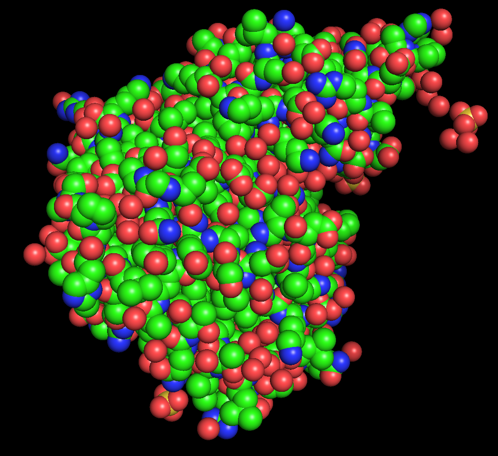
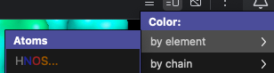

ПО: PyMOL

Белок: 8WZL (https://www.rcsb.org/structure/8WZL)

### Wireframe
В PyMOL выбран representation **Wire**

### Backbone
Выбран representation **Sticks**

### Spacefill
Выбран representation **Spheres**

### Ribbons
Выбран representation **Ribbon**

### Molecular surface
Выбран representation **Surface**

### CPK
Выбрана цветовая схема, которая красит атомы как в схеме CPK

### Раскраска по различным доменам
Выбрана цветовая схема Spectrum rainbow

### Публикационное качество
Выставлены следующие настройки:

А также Maximum Quality и Color space "CMYK (for publications)"

