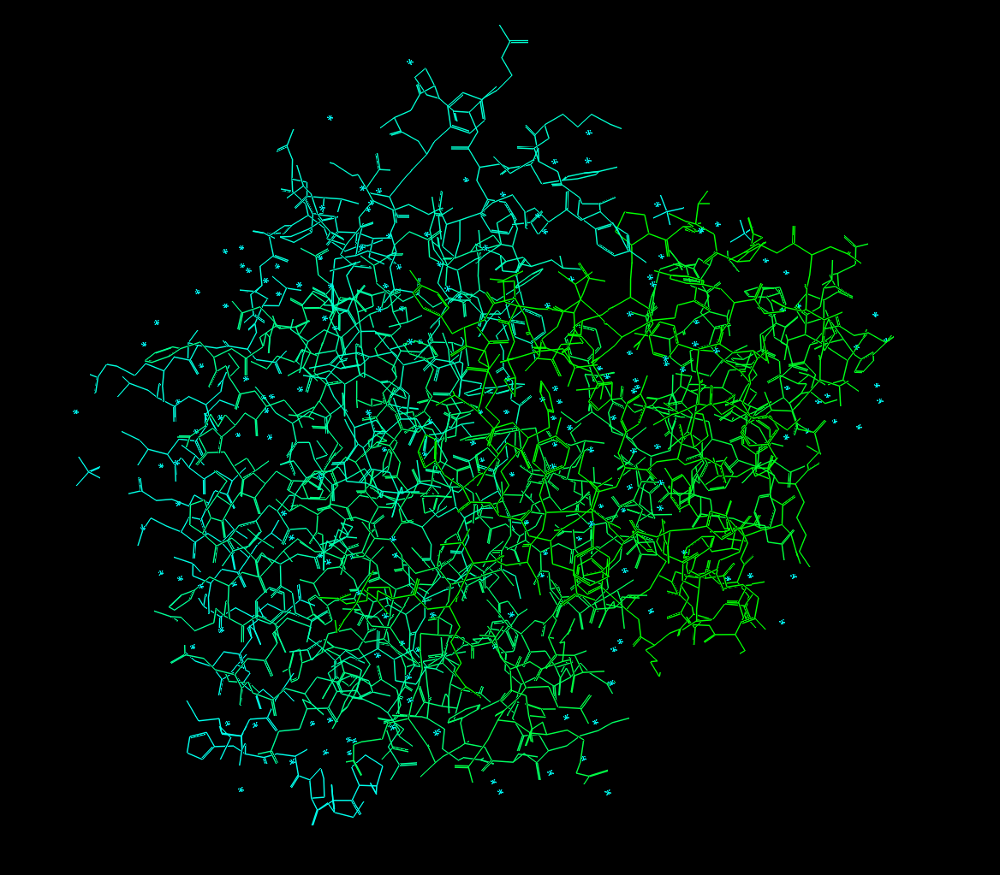
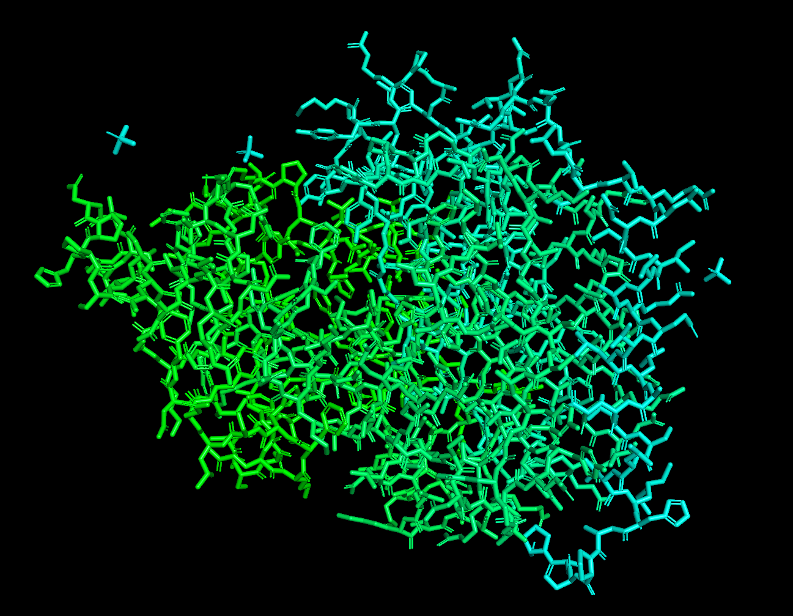
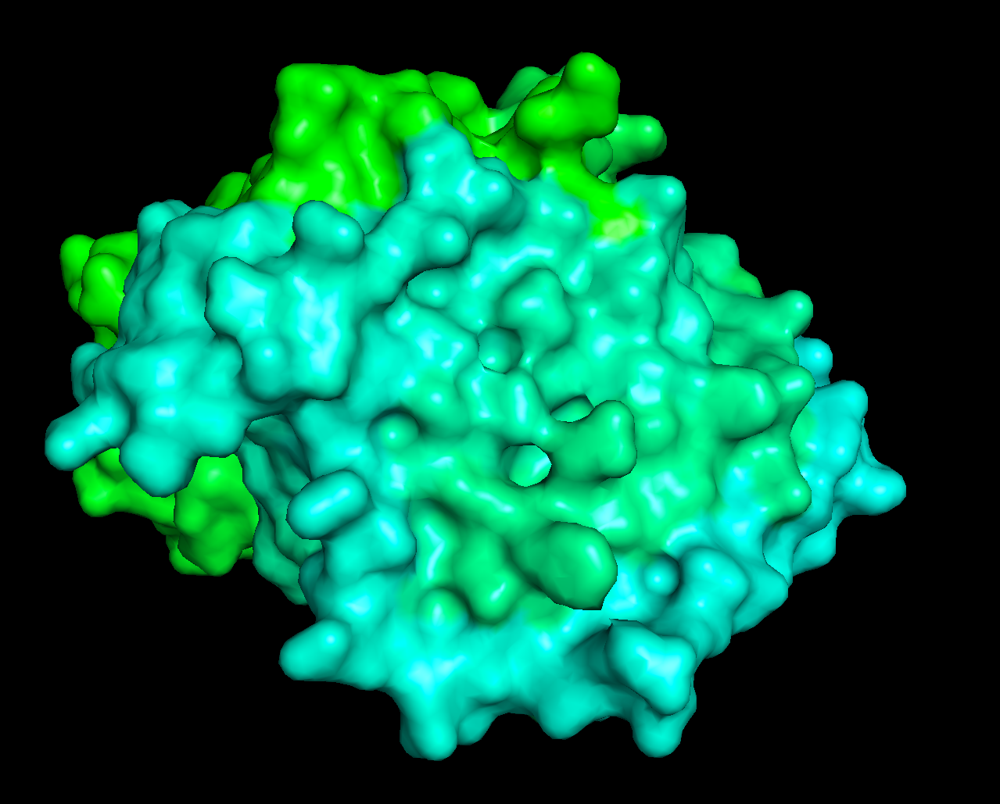
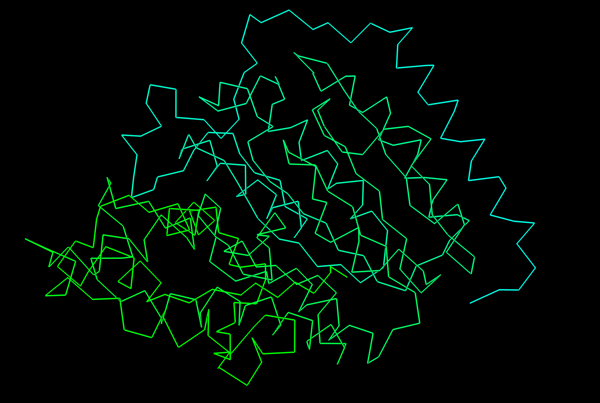
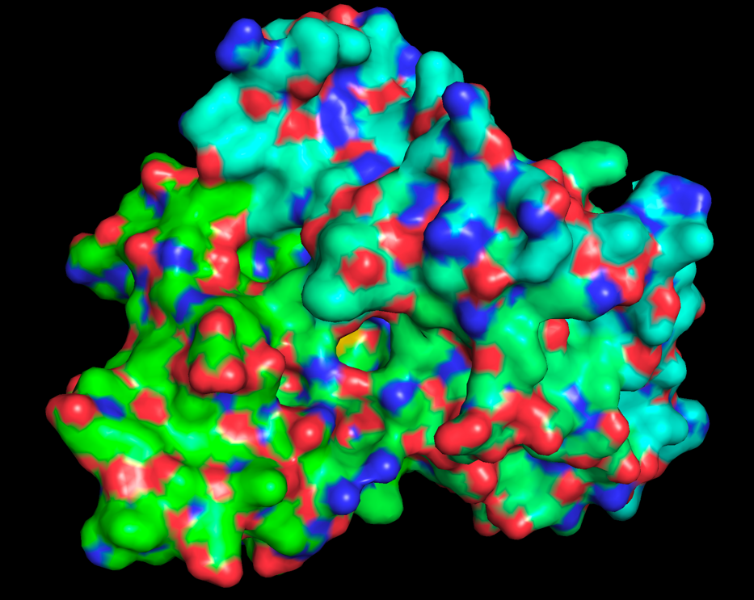
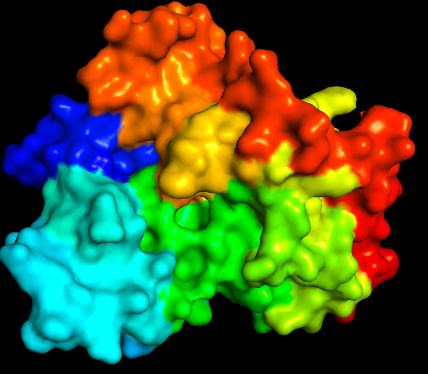
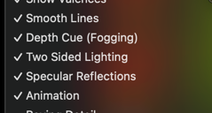
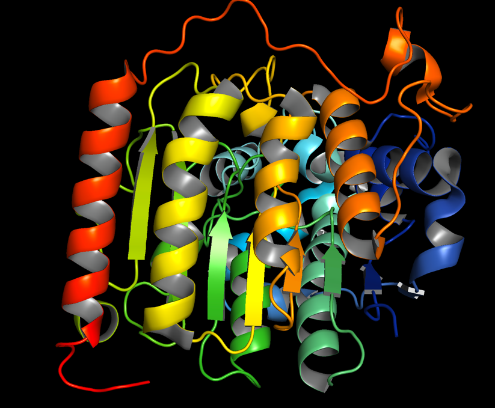

ПО: PyMOL

Белок: 8WZL (https://www.rcsb.org/structure/8WZL)

### Wireframe (Wire)

### Backbone (Sticks)

### Spacefill (Surface)

### Ribbons

### Molecular surface (Surface)

### CPK

### Раскраска по различным доменам

### Публикационное качество
Выставлены следующие настройки:

А также Maximum Quality и Color space "CMYK (for publicationы)"

