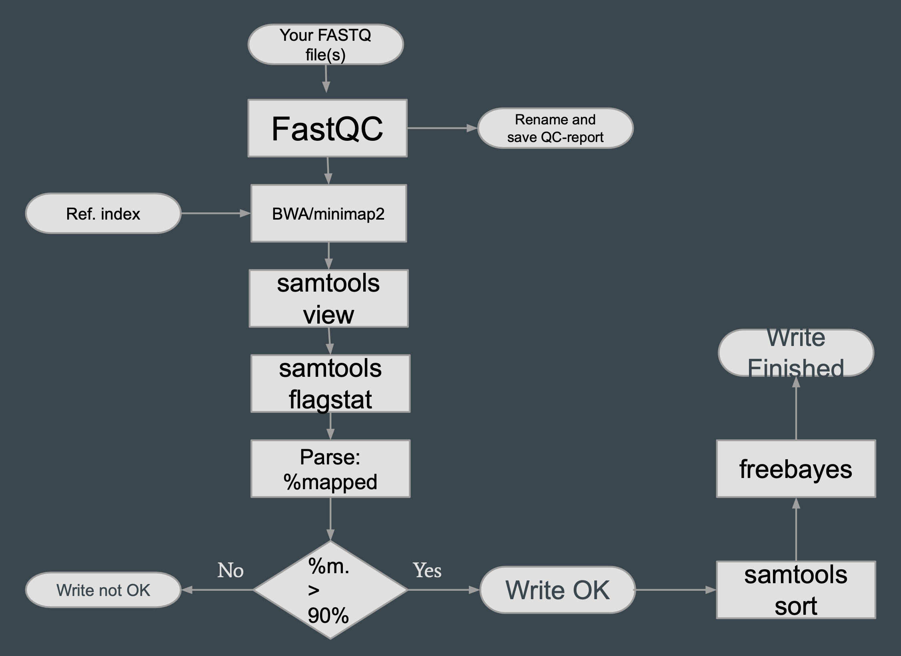

## Прочтения
- [Референсный геном (homo sapiens)](https://hgdownload.soe.ucsc.edu/goldenPath/hg38/bigZips/hg38.fa.gz)
- [Результат секвенирования (homo sapiens)](https://www.ebi.ac.uk/ena/browser/view/SRR12799740?show=reads)

## Результат
- [Скрипт](do_alg.sh)
- [Результат запуска flagstat](flagstat.txt)

## Инструкция по развёртыванию пайплайна Reflow
1. Зарегистрироваться в AWS. Нужно ввести ФИО, привязать телефон и карту (работают только иностранные).
2. Скачать бинарный файл с https://github.com/grailbio/reflow/releases/tag/reflow1.31.0.
Поддержана только x86 архитектура, ни на Mac M1, ни на Ubuntu в виртуальной машине не получилось запустить эту утилиту,
а также не собирается исходный код под ARM. 
Можно скачать ubuntu docker image для платформы linux/x86, 
запустить контейнер, и внутри него запускать reflow, т.к. это консольная утилита.
3. Создать Access-key в AWS (во вкладке Security Credentials)
4. ID ключа и сам ключ выставить в переменные окружения (а также регион):
- `export AWS_REGION="us-west-2"` 
- `export AWS_ACCESS_KEY="<key-id>"` 
- `export AWS_SECRET_KEY="<security-key>"`
5. Запустить конфигурирование reflow:

`./reflow1.31.0.linux.amd64 setup-ec2`

6. Создать s3-репозиторий:

`./reflow1.31.0.linux.amd64 setup-s3-repository reflow-quickstart-cache`

7. Создать dynamodb:

`./reflow1.31.0.linux.amd64 setup-dynamodb-assoc reflow-quickstart`

8. Создать файл с hello-world-скриптом:
- `touch hello.rf`
- `nano hello.rf`
- Вставить туда код

`val Main = exec(image := "ubuntu", mem := GiB) (out file) {"
echo hello world >>{{out}}
"}
`

9. Запускаем

`./reflow1.31.0.linux.amd64 run hello.rf`

Получаем:
```
reflow: run ID: ve5g58jl
ec2cluster: 0 instances:  (<=$0.0/hr), total{}, waiting{mem:1.0GiB cpu:1 disk:1.0GiB
reflow: total n=1 time=0s
ident      n   ncache transfer runtime(m) cpu mem(GiB) disk(GiB) tmp(GiB)
hello.Main 1   1      0B

a948904f
```

10. Суть пайплайна - загружаем докер-контейнеры с соответствующими утилитами
(bwa, samtools, freebayes) и в них выполняем нужные bash-команды.
Таким образом, можем переписать наш bash-скрипт на DSL Reflow в виде пайплайна:
[код пайплайна](do_alg.rf).

Reflow является консольной утилитой, поэтому визуализации пайплайна не предусмотрено.

Получившийся пайплайн является является реализацией блок-схемы из ДЗ.

