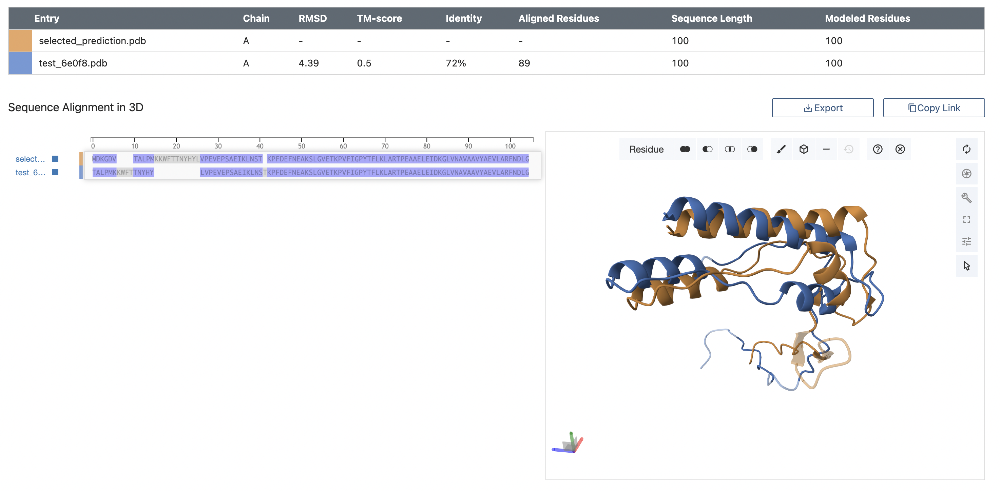
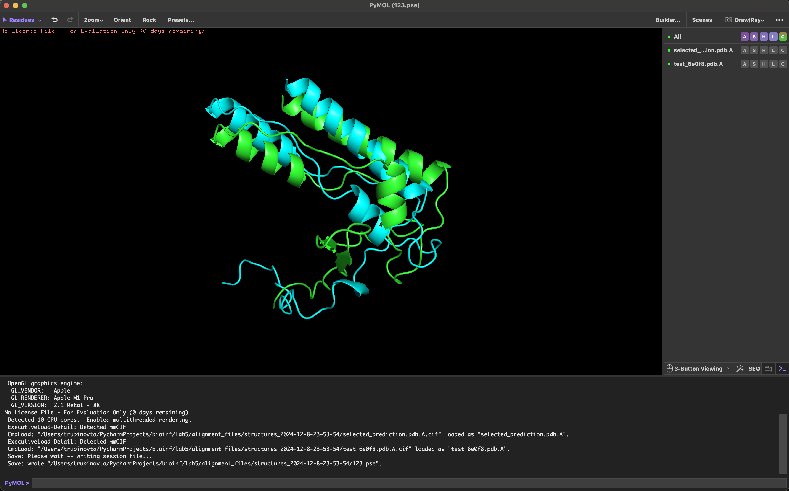

1. 
Последовательность - `MDKGDVTALPMKKWFTTNYHYLVPEVEPSAEIKLNSTKPFDEFNEAKSLGVETKPVFIGPYTFLKLARTPEAAELEIDKGLVNAVAAVYAEVLARFNDLG`
Название предсказателей:
- OpenFold
- OmegaFold
Выравниватель - jCE
2. 
Ноутбуки:
- [OmegaFold](notebooks/omegafold.ipynb)
- [OpenFold](notebooks/OpenFold.ipynb)
3. 
- [Предсказание с OmegaFold](structure_predictions/test_6e0f8.pdb)
- [Предсказание с OpenFold](structure_predictions/selected_prediction.pdb)
4. 
- [Результат выравнивания](alignment_files/sequence_alignment_2024-12-8-23-53-54.fasta)

- [Прочие файлы](alignment_files)
5. [PyMOL-сессия](pymol/pymol_session.pse)
6. 

7. Структуры получились похожими, но имеют небольшие различия (Identity = 72%).
Различия вызваны тем, что предсказания выполнены разными алгоритмами,
которые могут предсказывать структуру близкую к реальной,
но из-за того, что предсказания неидеальны, результат может отличаться.
